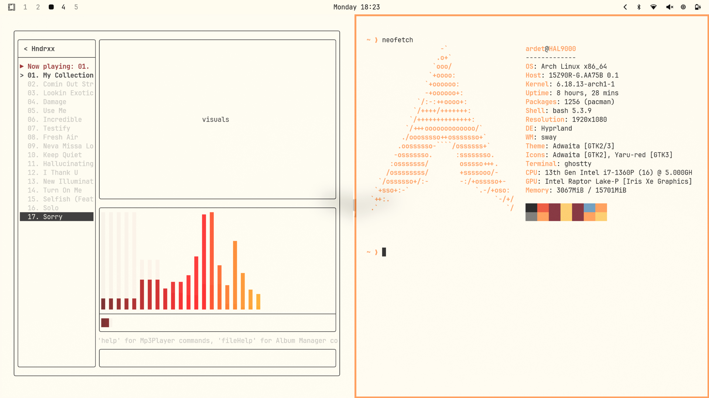
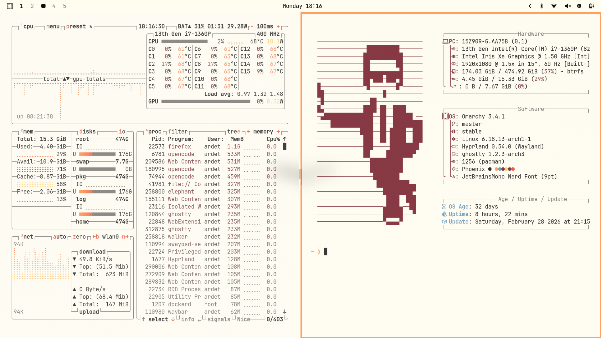
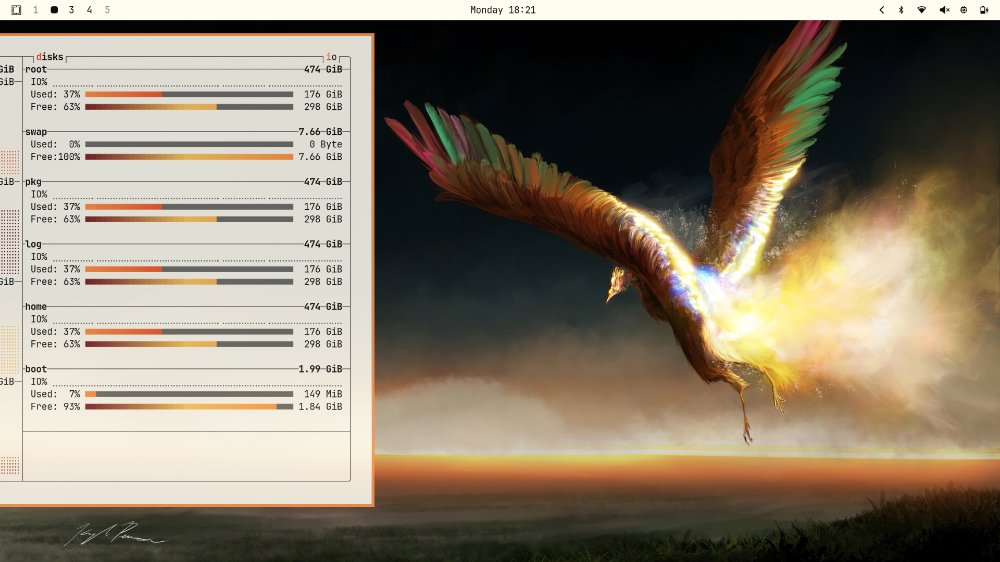
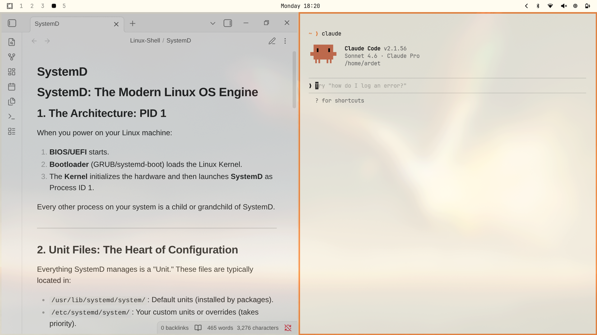
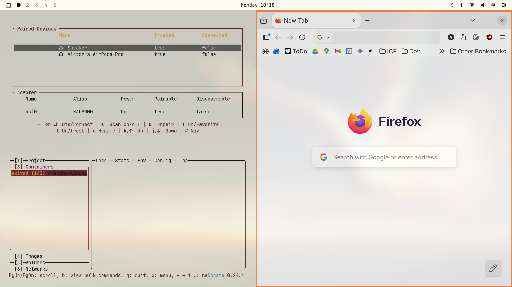
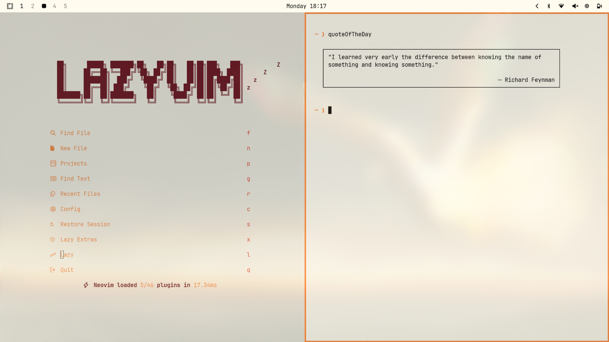

# Phoenix

Simple white-ish and orangy theme













---

## Claude Code Setup

Phoenix uses a **light-mode terminal surface** with custom ANSI colors. Without adjustment, Claude Code's built-in diff renderer will produce near-invisible diffs (dark red text on a dark red background).

The `setup.sh` script fixes this automatically by patching two Claude Code settings:

| File | Change | Why |
|------|--------|-----|
| `~/.claude/settings.json` | `"syntaxHighlightingDisabled": true` | Stops Claude Code from overriding terminal ANSI colors with its own palette |
| `~/.claude.json` | `"theme": "light"` | Switches Claude Code's diff renderer to light mode — red `−` lines get a light background with dark text |

### Run once after installing

```bash
bash ~/.config/omarchy/themes/phoenix/setup.sh
```

This installs an Omarchy `theme-set` hook so the settings apply and revert automatically whenever you switch themes. **Restart Claude Code after running.**

### What the hook does

- When you switch **to** Phoenix → applies both settings
- When you switch **away** from Phoenix → reverts both settings (your other themes are unaffected)

---

> *unica semper avis* — always the one-of-a-kind bird
> *ardet nec consumitor* — it burns but is not consumed
